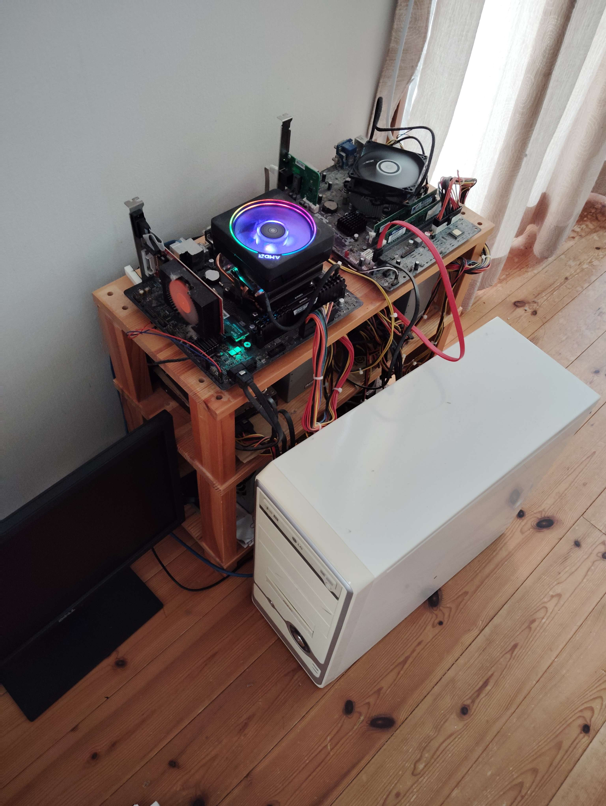

## うちの鯖の構成について

### ホスト一覧

|ホスト名|CPU|Cores/Threads|メモリ|ディスク(SSD)|ディスク(HDD)|
|:---|:---|:---|:---|:---|:---|
|proxmox00|i5-3450|4/4|10G|None|2TB/1TB|
|proxmox01|Ryzen5 3600X|6/12|48G|256G|500G/500G/1TB|
|proxmox03|Ryzen9 3900X|12/24|64G|256G|1TB/1TB|
|RaspberryPi3B+|ARMv8|4/4|1G|None|None|
|ここからしたは無関係
|メインPC|Ryzen5 3600XT|6/12|48G|1TB|None|
|のーとPC|Ryzen5 7530U|6/12|16G|512G|None|

### ネットワーク構成

### 物理

# お前もまな板教団に入らないか

